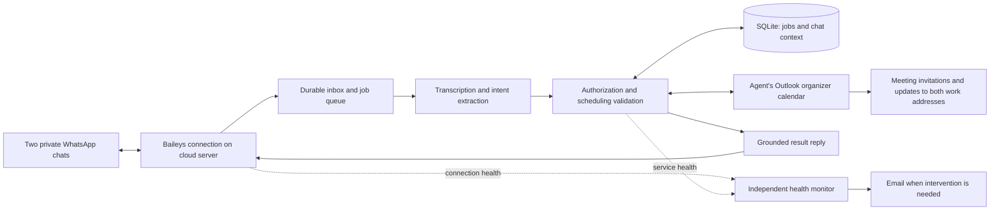

# Mazkir: family scheduling agent

## Approved voice extension — 14 September 2026

The user approved implementation after the grill-me interview. Receive Hebrew, English, and mixed voice notes up to three minutes. Voice input gets speech plus matching text; typed input gets text unless speech is explicitly requested. Follow explicit language requests or the message's main language, preserving names and titles. Clear requests execute immediately, with clarification only for ambiguity. Short responses match in both formats; long agendas have a short spoken summary and full text. Audio failure must not repeat a calendar change: send the text confirmation and a brief audio-unavailable notice. Keep the $8 monthly AI cap and prioritize core processing. Use one shared voice, selected after bilingual sample review.

Implementation: a durable reply-delivery stage stores generation state, encrypted output audio, and text-chunk progress in the existing encrypted job payload. No database schema migration is needed. Uncertain generation is not repeated. WhatsApp uses distinct stable IDs for text chunks and voice, with cached encrypted media metadata restored through the protocol decoder. Speech is character-priced `tts-1` with the user-selected `nova` voice, a 650-character input bound, and a measured 60-second output limit. Optional speech leaves $1 of the cap for core work. Full agenda text is chunked; model conversation context remains bounded. The user selected Nova after bilingual sample review on 14 September 2026. Production rollout remains pending.

Approved design, implementation installed on server — 9 September 2026. The user provisioned DigitalOcean Droplet YOUR_DROPLET; the application is installed at /opt/mazkir and its container build and offline demo pass. The service is stopped pending account configuration and pairing. No invitations have been sent. Product decisions below were agreed during the grill-me interview; see README.md for implemented behavior, validation, and limitations.

## Agreed product behavior

| Area | Decision |
| --- | --- |
| Availability | Run in the cloud, independent of the user's computer. Occasional phone-side maintenance is acceptable. |
| WhatsApp | Dedicated personal account and number, connected through an unofficial WhatsApp Web integration. The user accepted the disclosed account and connection risks. |
| Conversations | Separate private chats for the user and spouse, with separate conversational context and shared scheduling data. Group chat is a possible later addition. |
| Inputs | Text and voice notes in Hebrew, English, or a mixture. Reply in the message's language; preserve the user's wording/language in event titles. |
| Calendar delivery | Agent owns an organizer account and invites both work email addresses. Both recipients are assumed to use Outlook, based on the interview. |
| Actions | Create, edit, cancel, and answer questions about events managed by the agent. Either spouse can change events requested by the other. |
| Execution | Act immediately when the request is clear. Ask about essential ambiguity; do not add an approval step to clear requests. Confirm the resulting dates, time range, attendees, and recurrence scope in chat. |
| Defaults | 30-minute duration; Asia/Jerusalem time including daylight saving changes, even when either user travels, unless another time zone is explicit. |
| Recurrence | Support recurring events. A weekday alone describes a single event; an explicit repetition describes a series. Edits/cancellations default to the next occurrence unless broader scope is requested. |
| Calendar access | No work-calendar access or conflict checking. Agenda answers cover only agent-managed events. |
| Reminders | Use Outlook reminders. No additional event reminders over WhatsApp. |
| Operations | Email the user when intervention is needed. Routine recovery stays quiet. |
| Scale and cost | Plan for 20 inbound scheduling messages/day across both users, including edits and follow-ups. Monthly budget ceiling: US$20, excluding the phone line. |
| Deferred | Grocery lists/Bring, group chat, and work-calendar availability checks. |

## Proposed technical design

Use a small TypeScript/Node.js application with Baileys for WhatsApp, Microsoft Graph for a dedicated personal Outlook.com organizer calendar, OpenAI for language interpretation/transcription, and SQLite for local durable state. Host one instance on a DigitalOcean 1 GiB Basic Droplet, subject to measured memory usage. An independent Healthchecks.io monitor provides email alerts even if the server or its Microsoft authentication fails.

The service keeps the WhatsApp connection available continuously. AI calls happen when messages need processing; the model does not run continuously. Only the two configured WhatsApp identities may issue commands. Resolve WhatsApp's actual account identifiers during pairing; do not authorize using display names.

The calendar provider is authoritative for event content. SQLite stores conversation references, provider event/series identifiers, processed message IDs, queued operations, delivery status, and usage totals. Query the organizer calendar for current agenda answers and before modifying an event. Keep messaging, language, and calendar integrations behind separate modules so later group support can reuse scheduling behavior.

### Operations and consistency

Internal actions are `create_event`, `update_event`, `cancel_event`, `list_events`, and `clarify`. Mutations carry an actor, source message ID, resolved event identity, time zone, time range, attendee set, and recurrence scope. Model output is an untrusted proposed action; validate it in code before calling Graph. Give the model no arbitrary shell, mailbox, or recipient-management capability.

Persist inbound messages before processing and deduplicate by their stable provider IDs. Serialize mutations to shared events so simultaneous requests from the spouses cannot silently overwrite one another. Persist operation intent before a provider write. Use Graph's creation transaction identifier and reconcile uncertain results before retrying. A lost response must not create another invitation. Record successful calendar changes before sending the chat receipt; a failed chat reply must not repeat a calendar change.

Use actual occurrence identifiers for individual recurrence changes. Treat “from now on” distinctly from “the entire series”: future-only changes may require ending the old series and creating a replacement, preserving past events and applicable exceptions. Persist and reconcile those steps individually. Never claim all steps completed after a partial failure.

Reconnect automatically when possible, use bounded retries for transient failures, and email when manual action is needed. Distinguish “calendar operation succeeded” from “attendees accepted”: an API success does not prove either employer delivered or automatically accepted the invitation.

### Additional proposed defaults

- Resolve an unqualified weekday to its next future occurrence when the context is clear, and include its calendar date in the receipt. Ask if wording/context admits materially different interpretations.
- An explicitly recurring event without an end date continues until canceled. State that in its creation receipt.
- For an edit that matches multiple events, ask the user to identify the event instead of guessing.
- If an outage leaves an unsent creation request whose start time has passed, ask whether to schedule it rather than silently creating a past event.
- Bound conversation context to the recent relevant discussion; retrieve older events from the organizer calendar. Proposed application chat/transcript retention: 30 days. Delete downloaded voice media after processing. Provider-side retention and the phone's WhatsApp history are separate.
- Store credentials/session data outside source control, restrict access, encrypt stored secrets, and redact logs. Keep restoration keys separately from backups.
- Keep provider-specific model names, pricing, time-zone mappings, and limits in central configuration. Record real usage and bound retries, context, and output sizes. Apply an application AI spending cap with an explicit failure reply when exhausted; billing alerts alone are not a hard cap.

## Proposed accounts and setup

1. Personal WhatsApp number and primary phone account; pair the server and preserve its session securely. WhatsApp states the primary account must be used at least every 14 days to retain linked devices. [WhatsApp guidance](https://faq.whatsapp.com/1046791737425017/?cms_platform=android)
2. Dedicated personal Outlook.com organizer account and a user-controlled Azure/Entra app registration supporting personal Microsoft accounts. Authorize only that organizer's calendar, with refresh-token support. Microsoft documents personal-account calendar access and a free Azure signup route for an app-registration tenant; actual onboarding must still be verified. [Calendar permissions](https://learn.microsoft.com/en-us/graph/api/calendar-post-events?view=graph-rest-1.0), [app registration](https://learn.microsoft.com/en-us/graph/auth-register-app-v2)
3. DigitalOcean account for the server/backups; OpenAI API billing for interpretation/transcription; independent monitoring account and the user's alert email.

Only the work email addresses are needed for attendees. Do not request either employer's mailbox credentials. Account creation, sign-in, API access, and both employers' handling of external invitations remain setup dependencies.

Baileys is explicitly unofficial. A cloud host removes dependence on the user's computer but cannot guarantee uninterrupted WhatsApp access. [Baileys project](https://github.com/WhiskeySockets/Baileys)

## Cost model

This is a scenario estimate, not a guaranteed bill. Assume a 30-day month, 600 inbound messages, aggregate model use of 8,000 input and 600 output tokens per message across all calls, and up to 600 voice minutes/month. Token and audio assumptions have not been measured.

| Component | Monthly estimate, before taxes |
| --- | ---: |
| DigitalOcean 1 GiB Basic server | $6.00 |
| Weekly server backups at 20% | $1.20 |
| GPT-4.1 Mini: 4.8M input tokens and 0.36M output tokens | $2.50 |
| gpt-4o-mini-transcribe: 600 minutes | $1.80 |
| Healthchecks.io Hobbyist monitoring | $0.00 |
| Estimated subtotal | **$11.50** |

Sources: [DigitalOcean server and backup prices](https://www.digitalocean.com/pricing/droplets), [GPT-4.1 Mini rates](https://developers.openai.com/api/docs/models/gpt-4.1-mini), [transcription rates](https://developers.openai.com/api/docs/pricing), [monitoring plan](https://healthchecks.io/pricing/).

GPT-4.1 Mini is a documented cost baseline and initial candidate, not a claim that it is the best available model. Validate Hebrew/English scheduling accuracy and voice transcription before choosing the production configuration. Any model or server change must be costed within the agreed ceiling. The estimate leaves headroom for tax and variability; phone service, paid development/API evaluations, and any optional domain are not included. No domain is required by this proposed design. Weekly backups imply up to a week's loss of local conversation/job state; restore must reconcile with the live organizer calendar before accepting mutations.

## Implementation and acceptance

After agreement on the design, first prove the integrations with a small prototype: personal-account WhatsApp pairing on the server and one organizer invitation reaching both work accounts. Then implement validated intents, durable operations, recurrence, agenda queries, voice, and monitoring.

Acceptance checks:

- Both users can create, modify, and cancel an invitation while the development computer is off.
- Both work accounts receive creation, update, occurrence cancellation, and series cancellation without duplicate active events; record the recipients' actual acceptance/reminder behavior.
- Hebrew, English, mixed-language text, and representative voice notes produce correct dates, titles, and attendees.
- Israel daylight saving transitions retain the requested local hour; explicit other time zones work correctly.
- Recurrence edits preserve unaffected occurrences and past history.
- Duplicate delivery, lost API responses, concurrent edits, and service restarts do not duplicate calendar mutations.
- Unrecognized WhatsApp identities cannot read or change the family's events.
- A disconnected session or unavailable server produces an independent email alert; recoverable interruptions remain quiet.
- A backup can be restored and reconciled without replaying completed jobs.
- Measured memory, token usage, audio minutes, and provider bills fit the budget. Target normal text replies within 15 seconds, with voice processing potentially longer; measure rather than promise an availability SLA.

Before relying on the agent for everyday scheduling, run a short live pilot through restarts and reconnection. Revisit hosting size, model quality, backup frequency, and group support only when usage or the pilot provides a reason.
